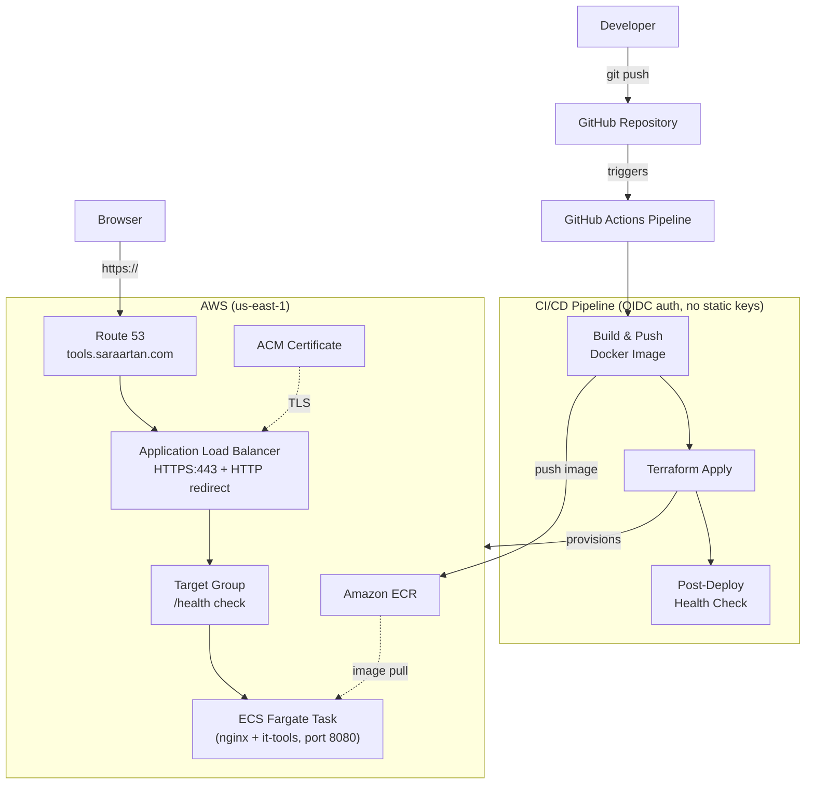
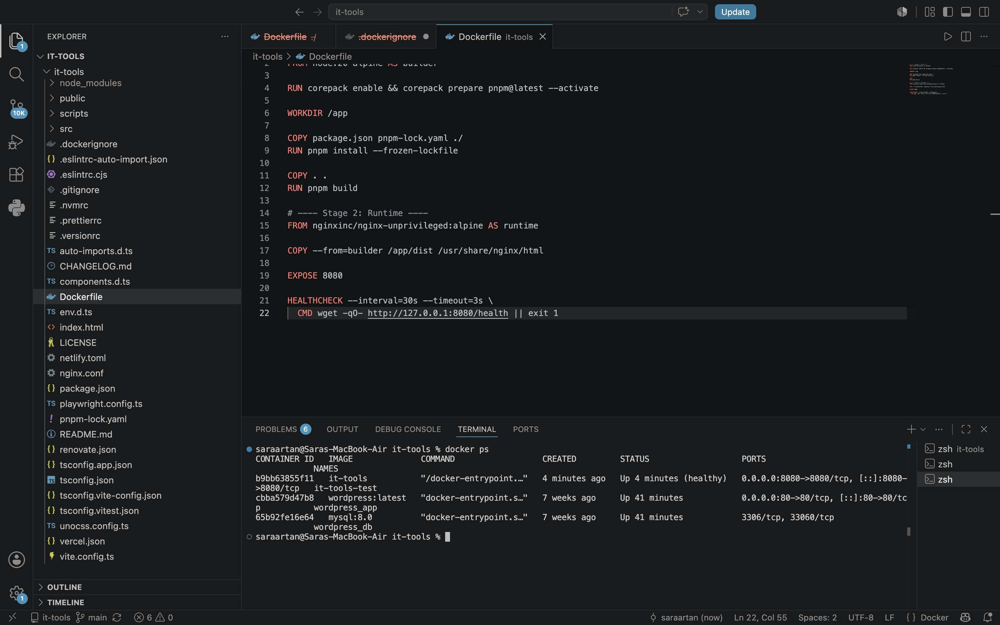
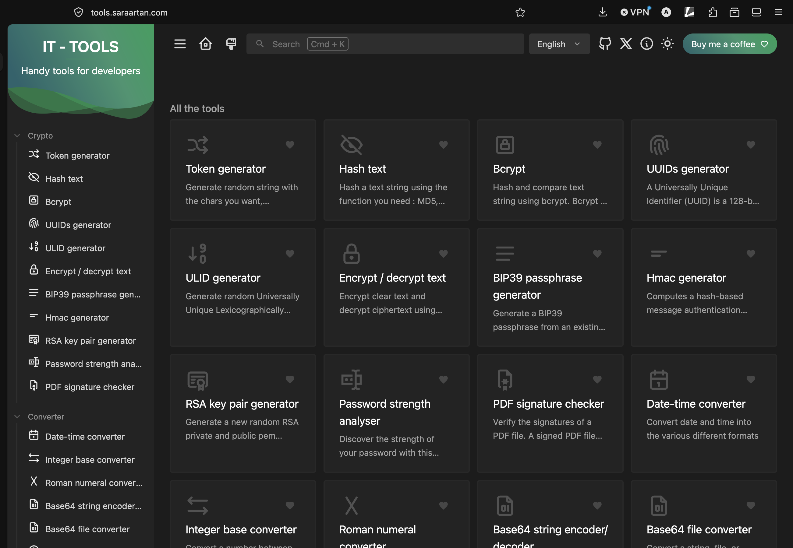
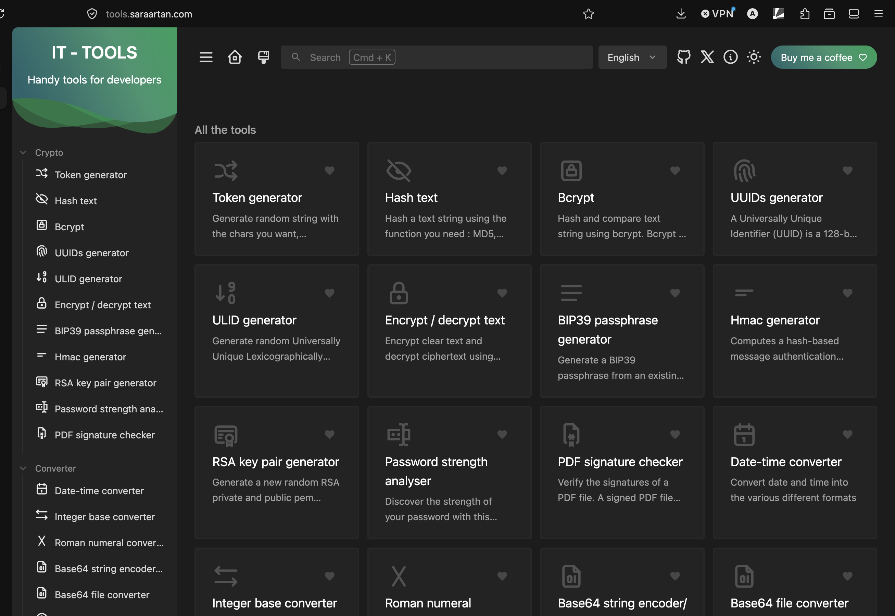

# it-tools — Deployed on AWS ECS with Terraform & CI/CD

A live deployment of [it-tools](https://github.com/CorentinTh/it-tools) — an open-source developer utilities web app — containerized with Docker, hosted on AWS ECS Fargate, provisioned entirely with Terraform, and deployed automatically via GitHub Actions.

**Live URL:** [https://tools.saraartan.com](https://tools.saraartan.com)

## Overview

This project takes an existing open-source web application and deploys it the way a real production workload would be: containerized, load-balanced, secured with HTTPS on a custom domain, defined entirely as infrastructure-as-code, and deployed automatically on every push to `main`.

The infrastructure was first built manually through the AWS Console (ClickOps) to understand each component, then torn down and rebuilt identically using Terraform — matching the project's "understand first, automate later" philosophy.

## Architecture



**Flow:** a push to `main` triggers GitHub Actions, which builds the Docker image, pushes it to ECR, then runs `terraform apply` to update the ECS service — all authenticated via OIDC (no long-lived AWS credentials stored in GitHub). The load balancer continuously health-checks the running task via `/health` and only routes traffic to healthy instances.

## Tech stack

- **App:** [it-tools](https://github.com/CorentinTh/it-tools) (Vue 3 / Vite, static SPA)
- **Container:** Docker, multi-stage build (Node builder → nginx-unprivileged runtime), non-root user
- **Registry:** Amazon ECR
- **Compute:** AWS ECS on Fargate (serverless containers)
- **Networking:** Application Load Balancer, two-tier security groups (ALB open to internet, service only reachable from ALB)
- **DNS & TLS:** Route 53 (subdomain-delegated from Cloudflare) + AWS Certificate Manager
- **Infrastructure as Code:** Terraform, remote state in S3
- **CI/CD:** GitHub Actions, OIDC federation (no stored AWS keys)

## Repository structure
*Note: application source code sits at the repository root rather than in a separate `app/` subdirectory — this keeps Dockerfile build paths simple and matches how the upstream it-tools repo is structured.*

## Screenshots

**Docker container running healthy:**


**App live on AWS:**


**Successful CI/CD pipeline run:**


**Valid HTTPS on custom domain:**


## How it was built

1. **App setup** — cloned it-tools, added a static `/health` endpoint (`public/health`) for load balancer health checks, verified locally with `pnpm dev`.
2. **Containerization** — wrote a multi-stage Dockerfile (Node build stage → nginx-unprivileged runtime stage), non-root user, health check baked in.
3. **Registry** — pushed the built image to a private, vulnerability-scanned ECR repository, tagged by commit SHA.
4. **Manual infrastructure (ClickOps)** — built the full stack by hand in the AWS Console (ACM, security groups, ECS cluster/task/service, ALB, Route 53) to understand each piece, confirmed the site was live, then tore it all down.
5. **Terraform** — rebuilt the identical infrastructure as code, with resources referencing each other's actual IDs (eliminating an entire class of misconfiguration bugs encountered during the manual build).
6. **CI/CD** — added a GitHub Actions pipeline authenticating to AWS via OIDC (no stored credentials), building and pushing the image, running `terraform apply`, and verifying the live `/health` endpoint post-deploy.

## Reproducing this setup

**Prerequisites:** AWS account, a domain (or subdomain) you can point at Route 53, Docker, Terraform ≥1.5, AWS CLI configured with an IAM user (not root).

```bash
# 1. Clone this repo
git clone https://github.com/saraartan/it-tools-devops-project.git
cd it-tools-devops-project

# 2. Build and test the container locally
docker build -t it-tools .
docker run -d -p 8080:8080 --name it-tools-test it-tools
curl http://localhost:8080/health   # expect {"status":"ok"}

# 3. Push to your own ECR repository
aws ecr create-repository --repository-name it-tools --image-scanning-configuration scanOnPush=true
aws ecr get-login-password --region <region> | docker login --username AWS --password-stdin <account-id>.dkr.ecr.<region>.amazonaws.com
docker tag it-tools:latest <account-id>.dkr.ecr.<region>.amazonaws.com/it-tools:latest
docker push <account-id>.dkr.ecr.<region>.amazonaws.com/it-tools:latest

# 4. Set up Terraform variables
cd infra
cat > terraform.tfvars << TFVARS
hosted_zone_id  = "<your-route53-hosted-zone-id>"
container_image = "<account-id>.dkr.ecr.<region>.amazonaws.com/it-tools:latest"
TFVARS

# 5. Provision the infrastructure
terraform init
terraform plan
terraform apply

# 6. Set up GitHub Actions
# - Add the github_actions_role_arn output as the role-to-assume in .github/workflows/deploy.yml
# - Push to main to trigger the pipeline
```

## Cleaning up

```bash
cd infra
terraform destroy
```
