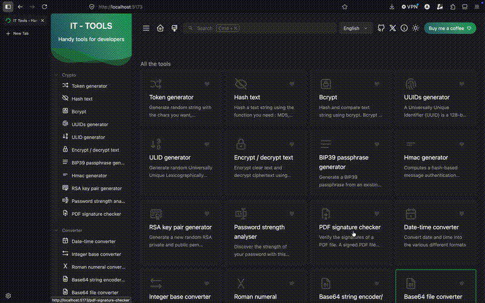
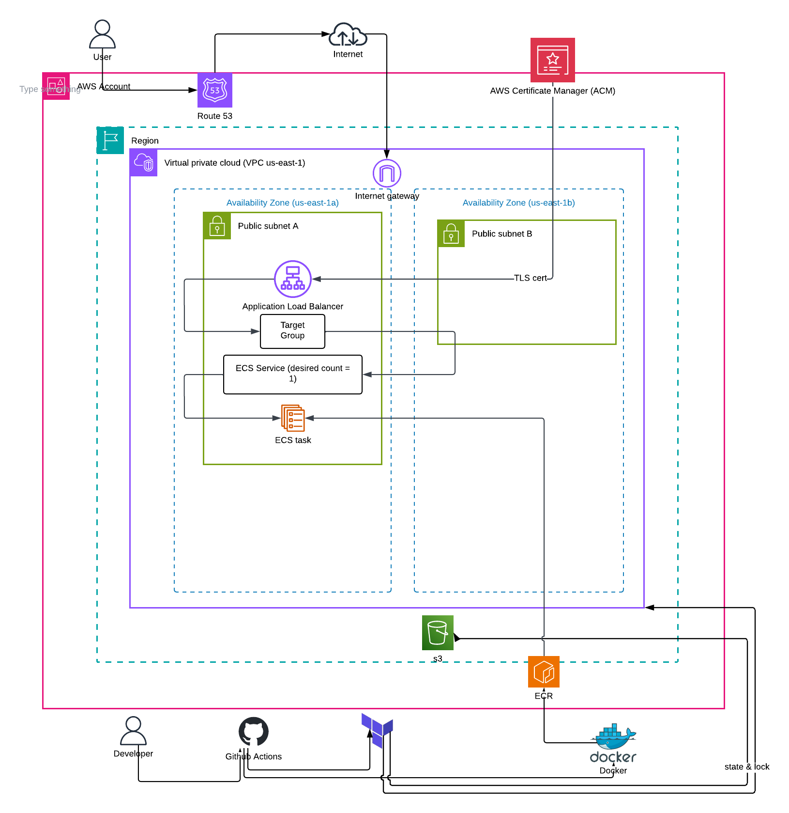
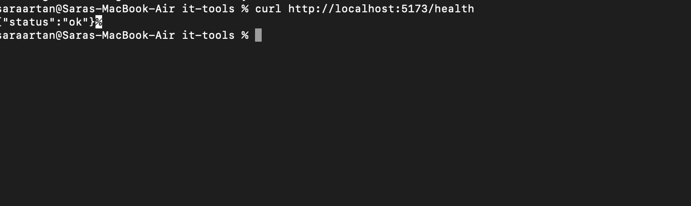
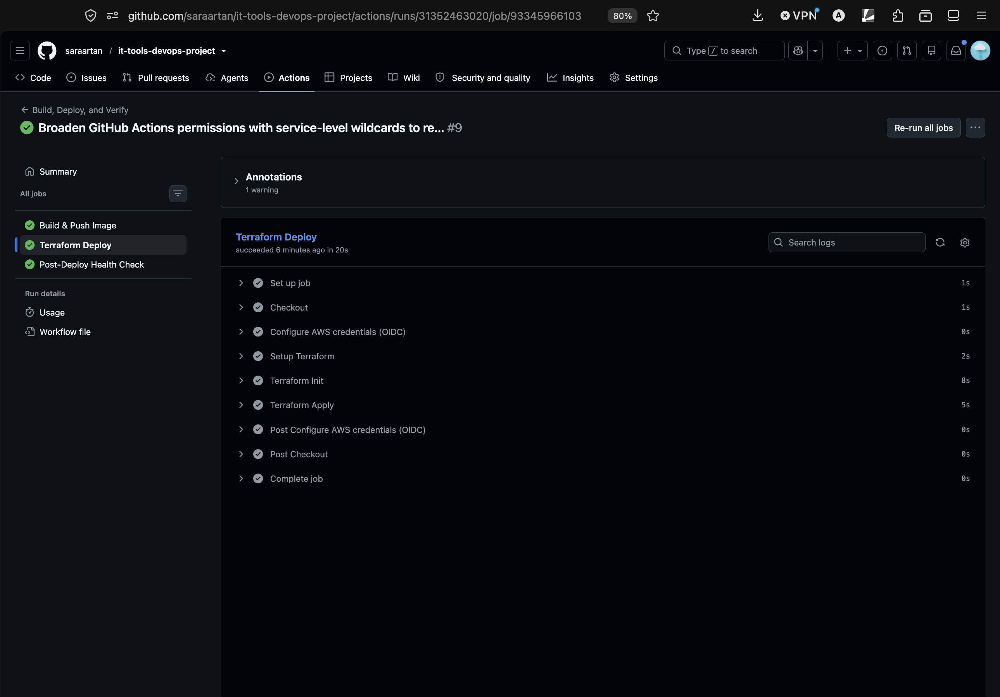
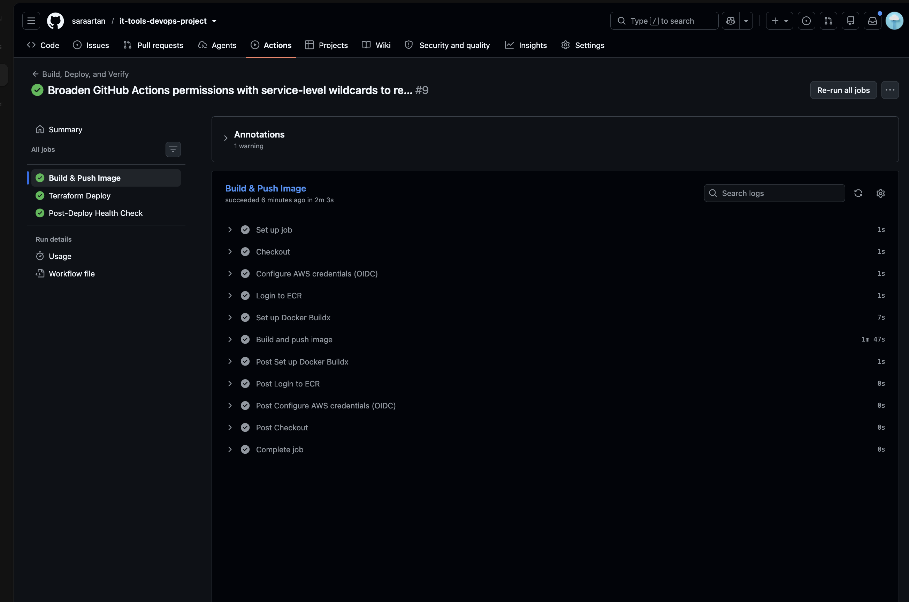
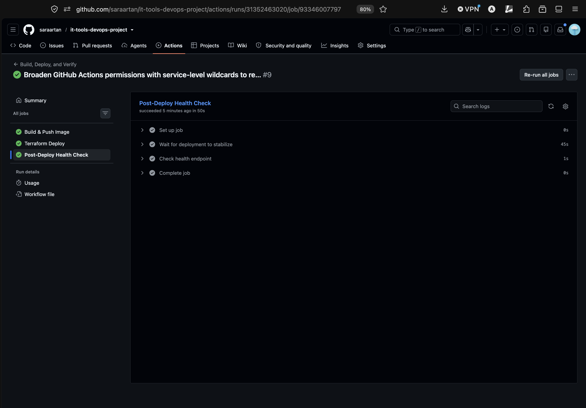

# it-tools: Deployed on AWS ECS with Terraform & CI/CD

A deployment of [it-tools](https://github.com/CorentinTh/it-tools), an open-source developer utilities web app. It's containerized with Docker, hosted on AWS ECS Fargate, provisioned with Terraform, and deployed automatically via GitHub Actions.

**Demo:** the infrastructure is torn down between sessions to avoid ongoing AWS costs, so here's the app running locally instead of a live link:



## Overview

This project takes an existing open-source web application and deploys it the way a real production workload would be: containerized, load-balanced, secured with HTTPS on a custom domain, defined entirely as infrastructure-as-code, and deployed automatically on every push to `main`.

The infrastructure was first built manually through the AWS Console (ClickOps) to understand each component, then torn down and rebuilt identically using Terraform, matching the project's "understand first, automate later" philosophy.


## Why this app, why ECS, and expected scale

I hosted it on ECS deliberately. Vercel or Netlify would get this specific app live faster, but they abstract away exactly what I wanted to build: load balancing with real health checks, IAM-scoped access control, infrastructure defined as code instead of console clicks. A VM was never the right call either. That's server administration, not container orchestration. ECS on Fargate gives full control over networking, scaling, and security without the overhead of managing the underlying compute. I built the stack manually in the AWS console first to understand every component, then rebuilt it identically in Terraform and automated the whole pipeline with GitHub Actions.

Current traffic is minimal since this is a portfolio deployment, not a production product. But it's architected to scale: 0.5 vCPU and 1GB of memory comfortably serves a few hundred concurrent users as-is, and scaling further is a config change, not a redesign: increase the desired task count or attach a CPU-based autoscaling policy, and the load balancer distributes traffic automatically. At real scale, say tens of thousands of daily users, the next move is CloudFront in front of the load balancer to cache static assets at the edge. For a fully static app at that volume, I would weigh ECS against a simpler S3 + CloudFront setup. For this project's purpose of demonstrating production-grade container orchestration, ECS was the right architecture.

## Architecture



**Flow:** a push to `main` triggers GitHub Actions, which builds the Docker image, pushes it to ECR, then runs `terraform apply` to update the ECS service. All of this is authenticated via OIDC, so no long-lived AWS credentials are stored in GitHub. The load balancer continuously health-checks the running task via `/health` and only routes traffic to healthy instances.

## Tech stack

- **App:** [it-tools](https://github.com/CorentinTh/it-tools) (Vue 3 / Vite, static SPA)
- **Container:** Docker, multi-stage build (Node builder → nginx-unprivileged runtime), non-root user. Final image is 100MB vs 387MB for the base Node build image alone (a 74% reduction), since only the compiled static files ship in the production stage.
- **Registry:** Amazon ECR
- **Compute:** AWS ECS on Fargate (serverless containers)
- **Networking:** Application Load Balancer, two-tier security groups (ALB open to internet, service only reachable from ALB)
- **DNS & TLS:** Route 53 (subdomain-delegated from Cloudflare) + AWS Certificate Manager
- **Infrastructure as Code:** Terraform, remote state in S3
- **CI/CD:** GitHub Actions, OIDC federation (no stored AWS keys)

## Repository structure

```
it-tools-ecs/
├── app/                         # Application source (it-tools: Vue 3 + Vite)
├── bootstrap/                   # One-time setup before Terraform can run
│   ├── setup.sh                 # Creates S3 state bucket + ECR repo
│   └── README.md
├── terraform/                   # Infrastructure as Code
│   ├── main.tf                  # Root module, wires the modules together
│   ├── variables.tf
│   ├── outputs.tf
│   ├── provider.tf
│   ├── backend.tf               # S3 remote state config
│   ├── github-oidc.tf           # OIDC trust for CI/CD
│   └── modules/
│       ├── vpc/                 # VPC + subnet lookup
│       ├── alb/                 # ALB, listeners, target group, security group
│       ├── ecs/                 # Cluster, service, task def, IAM, logs
│       └── acm/                 # TLS certificate lookup
├── .github/workflows/
│   ├── docker-build.yml         # Build + push image to ECR
│   ├── terraform-deploy.yml     # fmt, validate, apply, health check
│   └── terraform-destroy.yml    # Manual-only destroy pipeline
├── Dockerfile                   # Multi-stage build: Node build -> nginx runtime
├── .dockerignore
├── README.md
├── screenshots/
└── .gitignore
```

## Screenshots

**Local health check (Phase 1):**


**Docker container running healthy (Phase 2):**


**App live on AWS:**


**Successful CI/CD pipeline run:**




**Valid HTTPS on custom domain:**


## How it was built

1. **App setup**: cloned it-tools, added a static `/health` endpoint (`public/health`) for load balancer health checks, verified locally with `pnpm dev`.
2. **Containerization**: wrote a multi-stage Dockerfile (Node build stage → nginx-unprivileged runtime stage), non-root user, health check baked in.
3. **Registry**: pushed the built image to a private, vulnerability-scanned ECR repository, tagged by commit SHA.
4. **Manual infrastructure (ClickOps)**: built the full stack by hand in the AWS Console (ACM, security groups, ECS cluster/task/service, ALB, Route 53) to understand each piece, confirmed the site was live, then tore it all down.
5. **Terraform**: rebuilt the identical infrastructure as code, with resources referencing each other's actual IDs (eliminating an entire class of misconfiguration bugs encountered during the manual build).
6. **CI/CD**: added a GitHub Actions pipeline authenticating to AWS via OIDC (no stored credentials), building and pushing the image, running `terraform apply`, and verifying the live `/health` endpoint post-deploy.

## Reproducing this setup

**Prerequisites:** AWS account, a domain (or subdomain) you can point at Route 53, Docker, Terraform ≥1.5, AWS CLI configured with an IAM user (not root).

```bash
# 1. Clone this repo
git clone https://github.com/saraartan/it-tools-ecs.git
cd it-tools-ecs

# 2. Build and test the container locally
docker build -t it-tools .
docker run -d -p 8080:8080 --name it-tools-test it-tools
curl http://localhost:8080/health   # expect {"status":"ok"}

# 3. Push to your own ECR repository
aws ecr create-repository --repository-name it-tools --image-scanning-configuration scanOnPush=true
aws ecr get-login-password --region <region> | docker login --username AWS --password-stdin <account-id>.dkr.ecr.<region>.amazonaws.com
docker tag it-tools:latest <account-id>.dkr.ecr.<region>.amazonaws.com/it-tools:latest
docker push <account-id>.dkr.ecr.<region>.amazonaws.com/it-tools:latest

# 4. Run the bootstrap script (creates S3 state bucket + ECR repo, if not done in step 3)
cd bootstrap
chmod +x setup.sh
./setup.sh
cd ..

# 5. Set up Terraform variables
cd terraform
cat > terraform.tfvars << TFVARS
hosted_zone_id  = "<your-route53-hosted-zone-id>"
container_image = "<account-id>.dkr.ecr.<region>.amazonaws.com/it-tools:latest"
TFVARS

# 6. Provision the infrastructure
terraform init
terraform plan
terraform apply

# 7. Set up GitHub Actions
# - Add the github_actions_role_arn output as the role-to-assume in the
#   .github/workflows/*.yml files
# - Push to main to trigger docker-build.yml, which triggers terraform-deploy.yml
```

## Cleaning up

```bash
cd infra
terraform destroy
```
